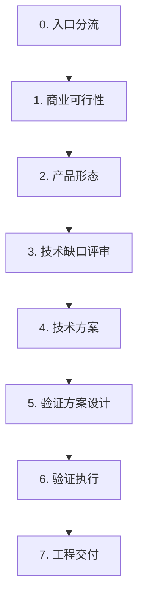

# Spec Intake

Turn a one-line requirement into a stage-gated Spec Driven JSON document.

The goal is not to write code. The goal is to make the requirement clear enough that business, product, AI engineering, QA, DevOps, and compliance can decide what the next gate is without relying on oral context.

## Core Rules

1. Extract first, ask second. If the user has already provided enough information for a field or decision, fill it, state the conclusion, and skip that question.
2. Ask one question at a time only for the highest-risk missing information.
3. First identify the company product form: Friday Agent, Domain Pack, Friday Memory, MorningStar, internal tool, standalone product, or demo.
4. For commercial ideas, validate business feasibility before product or technical detail.
5. Do not let vague commercial evidence move into engineering delivery.
6. If UI exists, produce an SVG wireframe and get it reviewed before product-ready or later gates.
7. If Domain Pack is involved, model Friday objects explicitly: Workspace Memory, Task, Artifact, Recipe, Feedback/Comment, and Room.
8. Treat engineering gap review as different from engineering delivery. A spec can be ready for technical gap review while still blocked for implementation.
9. Market validation includes competitor research. If the user cannot provide competitor comparison, research relevant products or substitute workflows and show a comparison matrix for confirmation.
10. Market validation includes market sizing. Do not use one vague TAM number; assess customer value, payment willingness, average contract value, addressable customer count, and competition intensity.
11. Product validation includes technical leadership and uniqueness. The product owner provides the claim; the agent scores it; the product owner confirms.
12. Technical design includes source-code reading and AI scoring. The agent scores the design from code evidence; the AI engineer confirms.
13. At the start of a new intake, show the user the complete process as a Mermaid flowchart and start a progress tracker. In Codex, this means calling `update_plan`.
14. Do not move from one stage to the next without an explicit stage-exit summary and user confirmation.
15. Use the schema stage names exactly. Do not invent a simplified five-stage process.
16. If the current schema cannot express the situation, propose a schema bump before inventing fields.
17. Business defines end-to-end success in `business_success_scenarios`. Product or the spec agent may structure the input, but only the business owner may confirm the expected business outcome. QA adds coverage and engineering adds automation through `validation_plan.scenario_coverage`; neither may silently rewrite the business outcome.
18. Product defines `delivery_risk_profile` from six concrete dimensions before engineering. The tier is at least the highest dimension floor, and the decision owner must confirm it before `product_ready` or later.
19. Product defines `product_context.product_goals`, `product_context.business_metrics`, `workflow.user_journeys`, and `workflow.user_operation_flows` before `product_ready` or later. Business defines the product/business goal first; product refines it into measurable product behavior and loop-engineering signals.
20. If the spec intake context becomes complex, multi-threaded, or long enough that earlier decisions may be forgotten, recommend using bounded subagents to advance evidence gathering, product shaping, code reading, or QA mapping. For design judgment, virtualize a multi-role review panel such as PM, algorithm, user, domain expert, researcher, owner, QA, compliance, sales, and engineering, let them challenge each other's assumptions, and record the result in `review_gates.virtual_review_panel`. The main agent must keep the stage gate, final judgment, and spec synthesis.

## Intake Modes

Support two intake modes and one explicit stop path:

- `guided_interview`: default for one-line, vague, or early customer requests. Ask one high-leverage question at a time.
- `structured_brief`: use when the user already gives a mature brief, wants to fill a template, or provides many fields at once. Extract all usable facts first, show only material gaps, then ask the single highest-risk missing question.
- `finish_now`: use when the user says "结束", "产出 spec", "输出产物", "到这里", "stop", "archive", or equivalent. Stop asking exploratory questions and produce the best current-stage artifacts.

Do not force `guided_interview` when the user has already supplied a structured brief. In `structured_brief`, ask for or extract these fields:

- Product basis.
- Target buyer and daily user.
- Pain, current alternative, and buyer language.
- Minimum paid artifact.
- Market sizing: customer value, payment willingness, average contract value, customer count, and competition intensity.
- Evidence and design partner status.
- Competitors or substitute workflows.
- Differentiation or technical leadership claim.
- Constraints: compliance, data access, integrations, and delivery limits.
- Desired stage and output.

If required fields are still missing, return a concise missing-field list and ask only the next question that changes the gate.

## Opening Protocol

On the first substantial response in a new spec-intake session, before asking the first business question:

1. State that the process is stage-gated and that the agent will not silently jump stages.
2. Show this Mermaid flowchart. Keep the syntax simple: do not put escaped line breaks such as `\n` inside node labels, and do not draw backward or dotted loop arrows because they make the chart hard to read in narrow clients.



Then explain the chart in Chinese:

- 入口分流：论证需求类型，先判断这是 Domain Pack、Friday Agent、Friday Memory、内部工具、独立产品还是 demo。
- 商业可行性：论证客户、买方、痛点、付费理由、竞品和证据，不急着设计产品。
- 产品形态：论证第一版工作流、范围、Artifact、UI 和对象模型。
- 技术缺口评审：论证现有能力和缺口，不代表可以排期。
- 技术方案：论证源码、架构方案、技术评分和交付风险，并由 AI 工程师确认。
- 验证方案设计：论证样本、指标、验收方式和时间盒；这是内部/产研验证方案，不等于客户 POC。
- 验证执行：论证数据、owner、baseline 都齐了，才开始跑内部验证。
- 工程交付：论证 spec、验证、责任人、排期和验收都确认后，才进入实现计划。

Then state rollback rules as text, not as chart arrows:

- Evidence missing: stay in `business_feasibility`.
- Scope unclear: stay in `product_shape`.
- Engineering gap unresolved: go back to `product_shape`.
- Technical design not confirmed: stay in `technical_spec`.

3. Call the runtime progress tool immediately. In Codex, `update_plan` is mandatory; do not replace it with a text-only progress line. Use these items:
   - Intake routing.
   - Business feasibility.
   - Product shape.
   - Engineering gap review.
   - Technical spec.
   - Validation design.
   - Validation execution.
   - Engineering delivery.
4. In each user-facing answer, also include a short stage status line:

```text
当前阶段：business_feasibility
进度：Intake routing 已确认；Business feasibility 进行中；未进入 product_shape。
```

Do not wait for the user to ask "where are we" before showing progress. If `update_plan` is unavailable because the runtime truly does not provide it, say that explicitly and then use text progress as the fallback.

After the opening protocol, choose the intake mode. If the user has not chosen a mode, infer it from the input:

- Sparse or one-line request: use `guided_interview`.
- Multi-field request, existing PRD, meeting notes, or completed brief: use `structured_brief`.
- Explicit stop/output command: use `finish_now`.

## Extraction Before Questions

The interaction is not a form-filling interview. At the start of each turn:

1. Parse the user's latest message and map any explicit facts to spec fields.
2. State concise conclusions for fields that are already clear.
3. Mark assumptions separately from confirmed facts.
4. Ask only the next question that would change the stage gate, priority decision, product shape, or technical readiness.

Good behavior:

> 你已经明确了买方、使用者和第一版目标，所以这三项我先写入 spec，不再追问。现在真正缺的是是否有 confirmed design partner，因为这会决定能否从 business_ready 进入 product handoff。

Bad behavior:

> 请依次回答：买方是谁？使用者是谁？第一版目标是什么？

Do not ask a question just because it appears in `references/question-bank.md`. The question bank is a menu. Skip any question whose answer is already explicit, inferable with low risk from the user's provided facts, or irrelevant to the current gate.

## Context Management

Spec intake can become long because business evidence, product shape, Domain Pack objects, Memory policy, wireframes, source-code review, and QA coverage may all appear in one conversation.

When the context becomes complex, remind the user that subagents can help prevent forgotten decisions and context overload. Use bounded subagents when any of these are true:

- The intake has multiple business scenarios, product forms, customer segments, or competing versions of the same requirement.
- The spec depends on several evidence sources such as meeting transcripts, customer notes, market reports, competitor research, and internal docs.
- The product shape requires UI, Domain Pack object modeling, Memory policy, user journeys, operation flows, and validation planning in one run.
- Technical gap review requires reading multiple repositories, docs, or source-code paths.
- The conversation is long enough that earlier confirmed facts, blockers, or stage-exit decisions may be easy to miss.

Suggested split:

- Evidence subagent: collect and summarize market, customer, competitor, and design-partner evidence with source links.
- Product subagent: expand workflow, user journeys, operation flows, object model, wireframe needs, and open product questions.
- Engineering subagent: inspect docs/code and return capability boundaries or implementation gaps.
- QA subagent: map business success scenarios and operation flows into QA coverage, metrics, and evaluation assets.

For design review, use a virtual review panel rather than a single generic "agent" perspective. The panel can include PM, algorithm/ML, real or representative user, domain expert, researcher, owner, QA, compliance, sales/GTM, and engineering roles. Choose only the roles that reduce real risk. Ask each role to state its review focus, challenge questions, findings, and decision impact. When views conflict, make the roles review each other's assumptions, then have the main agent synthesize the final decision and record it in `review_gates.virtual_review_panel`.

Do not delegate final ownership. The main agent remains responsible for:

- Preserving the stage gate and progress tracker.
- Passing only bounded, factual tasks to subagents.
- Verifying subagent evidence before writing it into the spec.
- Resolving conflicts and producing the final spec.

## Stage Names

Use only these `stage_gate.current_stage` names:

- `business_feasibility`
- `product_shape`
- `engineering_gap_review`
- `technical_spec`
- `validation_design`
- `validation_execution`
- `engineering_delivery`
- `stop_archive`
- `unknown`

`intake_routing` is only the entry step for identifying product form and request type. It is not product validation and not a replacement for `business_feasibility`.

Do not compress the flow into "market validation, product shape, validation design, technical review, engineering delivery" because that hides the distinction between `engineering_gap_review`, `technical_spec`, `validation_design`, and `validation_execution`.

Use "customer POC" only for the business-side customer pilot: design partner, budget owner, customer reviewer, customer data, acceptance method, and paid or procurement signal. Do not use `validation_design` or `validation_execution` to mean a customer POC.

## Required References

Read only as needed:

- `references/spec-schema.json` - v1.10 JSON structure.
- `references/question-bank.md` - question patterns by gate.
- `references/business-success-scenarios.md` - required when collecting, confirming, reviewing, or mapping business success scenarios, or when setting `product_ready`, `validation_design_ready`, or `engineering_ready`.
- `references/delivery-risk-profile.md` - required when collecting, assessing, confirming, or changing delivery risk, and before setting `product_ready` or a later readiness label.
- `scripts/validate_spec.py` - deterministic validator.

When the spec depends on Friday, Memory, Domain Pack, Recipe, Workspace, MCP, document upload, CRM, policy database, or any existing system, inspect the relevant local docs/code before declaring technical boundaries.

## Product Basis

Ask this early:

> 这个需求第一版应该基于我们哪个产品形态来做？A. Friday Agent；B. Domain Pack；C. Friday Memory；D. MorningStar；E. 内部工具；F. 全新独立产品；G. 只是 demo。

Do not infer this silently. A "tool" may be a Domain Pack, Friday Agent workflow, internal tool, or standalone product.

## Business Feasibility Gate

For a Domain Pack, customer POC, commercial product idea, or Pack prioritization request, first fill `opportunity_assessment`.

Ask for:

1. Customer segment: KA, SMB, hybrid, internal, or unknown.
2. Scenario level: L2, L3, L2-to-L3, or unknown.
3. Target buyer and daily user.
4. Current alternative and buyer language.
5. Minimum paid artifact: the smallest thing the buyer would pay for or commit resources to validate.
6. Evidence registry: separate assumptions from customer interviews, customer data, paid signals, usage data, and artifacts.
7. Design partner registry: name/status, budget owner, reviewer, committed resources, data availability.
8. PMF four-factor scores: customer willingness, market clarity, technical value, GTM repeatability.
9. Market sizing: customer value, customer payment willingness, average contract value, addressable customer count, competition intensity, market size summary, attractiveness score, and evidence confidence.
10. Opportunity priority: `机会优先级指数 = 商业价值 * 商业信号清晰度 / 产研投入量`.
11. Scope-reduction recommendation when scope expansion risk is high.
12. Competitive research: user-provided competitor comparison, or agent-researched comparison matrix when the user has none.

Market sizing should stay concrete:

- `customer_value`: how much value the customer gets if the problem is solved.
- `customer_payment_willingness`: whether the buyer has budget, urgency, and willingness to pay.
- `average_contract_value`: expected ACV, POC package size, seat revenue, or other pricing unit.
- `addressable_customer_count`: how many reachable customers match the ICP.
- `competition_intensity`: how crowded the market is and whether differentiation can defend the opportunity.
- `market_attractiveness_score`: a 1-5 judgment of whether the opportunity is large and attractive enough for product attention.
- `evidence_quality`: evidence mix and gaps behind the estimate.

If exact market numbers are unavailable, record a range, assumption, evidence level, confidence, and the next action to make the estimate less speculative. Do not block business validation only because TAM is imprecise, but do not mark `business_ready` or later without a structured market sizing judgment.

Market sizing evidence must be source-backed:

- Prefer external market evidence: consulting reports, industry reports, market research, public market data, analyst notes, or credible industry datasets.
- Require first-party customer evidence: customer interviews, customer data, paid signals, usage data, sales pipeline, budget owner feedback, or design partner feedback.
- Treat internal estimates as supplementary only. A market sizing conclusion based only on internal judgment is still `unverified_estimate` and cannot justify `business_ready`.
- For medium/high confidence, `top_8`, `supported`, `strongly_supported`, or `market_attractiveness_score >= 4`, require external market evidence plus first-party customer feedback.
- If external reports are unavailable, record that as `evidence_quality.evidence_gaps`, keep confidence low or partially supported, and ask for the next evidence-gathering action.

When showing PMF scores, include:

- The score.
- Why the score is low or high.
- What evidence would raise the score.
- Concrete adders or next actions to improve the score.

The business feasibility summary must make a decision-style statement, with uncertainty, about:

- Whether this looks worth pushing.
- Expected customer acceptance risk.
- Market potential or market breadth.
- Why the next stage is allowed or blocked.

Use evidence levels:

- `hypothesis`: internal assumption.
- `anecdotal`: loose anecdote.
- `single_case`: one traceable customer or workflow case.
- `repeated`: repeated evidence across customers, flows, or channels.
- `commercial_proof`: paid POC, signed commitment, expansion, or repeatable GTM proof.

Do not approve customer POC unless there is a confirmed design partner, budget owner or committed resources, available data, baseline, acceptance method, timebox, and minimum paid artifact.

## Competitive Research Gate

In market validation, ask whether the business user already has competitor comparison.

Good question:

> 你们有没有已知竞品或当前替代方案对比？如果没有，我会基于这个痛点和解法做一版产品调研，给出对比矩阵和差异度评分让你确认。

If the user provides competitors, record them in `opportunity_assessment.competitive_research` with `status=user_provided`.

If the user says they already did competitor research, accept that work as input first; do not restart the research flow unless the evidence is missing, stale, or inconsistent with the target buyer.

If the user does not provide competitors, research relevant products or substitute workflows. Use current web/product research when available, cite sources in the comparison matrix, and state source type and confidence. Prefer official product pages or docs for product capabilities. Add public media, social, review, or customer-story evidence when it is current, relevant, and helpful for market validation. Compare at least:

- Target customer.
- Core workflow.
- Key capabilities.
- Pricing or packaging, if available.
- Strengths.
- Weaknesses.
- Overlap score, 1-5.
- Differentiation score, 1-5.

Use this scoring:

- `overlap_score`: 1 means barely solves the same problem; 5 means it addresses almost the same workflow and buyer need.
- `differentiation_score`: 1 means our proposed solution has no clear difference; 5 means it has a hard-to-copy difference in workflow, data, product loop, or delivery model.

Show the matrix to the user and ask for confirmation. Do not mark product-ready or later gates unless `competitive_research.user_confirmation=confirmed` when research is required.

## Stage Gate

Use `stage_gate` as the single source of truth for where the spec can go next.

Valid next gates include:

- `continue_business_validation`
- `handoff_to_product`
- `continue_product_shape`
- `request_engineering_gap_review`
- `continue_technical_spec`
- `mark_validation_design_ready`
- `mark_validation_execution_ready`
- `ready_for_engineering`
- `stop_archive`

Important distinctions:

- `handoff_to_product` means product should shape the product, not engineering should start.
- `request_engineering_gap_review` means AI engineering may identify capability gaps, not commit to delivery.
- `ready_for_engineering` means owners, scope, validation, implementation mapping, data policy, and gates are ready for implementation planning.

If `opportunity_assessment.priority_decision.recommendation` is `needs_more_evidence`, do not set the decision to `continue_technical_spec`, `mark_validation_design_ready`, `mark_validation_execution_ready`, or `ready_for_engineering`.

## Stage Exit Confirmation

Before changing `stage_gate.decision` to a next-stage decision, the agent must show a stage-exit summary and ask the user to confirm the transition.

Next-stage decisions are:

- `handoff_to_product`
- `request_engineering_gap_review`
- `continue_technical_spec`
- `mark_validation_design_ready`
- `mark_validation_execution_ready`
- `ready_for_engineering`

The stage-exit summary must include:

1. Current stage.
2. Proposed next stage.
3. Confirmed facts.
4. Remaining assumptions or blockers.
5. Why the next stage is allowed.
6. What is explicitly not allowed yet.
7. A direct confirmation question.

Record the answer in `stage_gate.stage_exit_check`.

Use this wording pattern:

> 我建议把当前阶段从 `business_feasibility` 切到 `product_shape`。已确认的是 X；还没确认的是 Y；因此只能交给产品收敛形态，不能进入客户 POC、内部验证或工程。是否确认结束业务验证并进入产品形态？A. 确认进入；B. 继续业务验证。

If the user does not confirm, keep the current stage and set the decision to `continue_business_validation` or `continue_product_shape`.

If the user invokes `finish_now`, do not fabricate a confirmed next-stage transition. Set `stage_gate` from the facts already confirmed:

- Use `handoff_to_product` only if the user explicitly confirms ending business validation or the prior conversation already contains that confirmation.
- Otherwise use the appropriate continue decision, such as `continue_business_validation` or `continue_product_shape`.
- Put unconfirmed transition items in `missing_fields` or `blocked_next_actions`.

Do not say "business validation passed", "P0 成立", or "商业上已经成立" when material blockers remain. Use precise language:

- "商业假设较强，但仍需补证据。"
- "可以进入产品形态收敛，但不代表可以进入客户 POC、内部验证或工程。"
- "建议列为 P0 市场验证候选，而不是 P0 交付项。"

For `business_feasibility`, do not propose `handoff_to_product` until these have been summarized:

- Product basis.
- Target buyer.
- Business acceptance owner or reviewer.
- Current alternative.
- Minimum paid artifact.
- Evidence level and which items are assumptions.
- PMF four-factor low score.
- Market sizing and market attractiveness score.
- Opportunity priority score and scope risk.
- Competitive research status.
- Blocked next actions.

## Product Shape Gate

After the commercial gate, define:

- `product_context`
- `business_context`
- `scope`
- `workflow.canonical_workflow`
- `business_success_scenarios`
- `delivery_risk_profile`
- `product_context.product_goals`
- `product_context.business_metrics`
- `workflow.user_journeys`
- `workflow.user_operation_flows`
- `friday_object_model`
- `ui_requirements`
- `capability_boundaries`

Put `spec_type` inside `product_context.spec_type`; do not output a separate top-level `spec_type`.

The `workflow.canonical_workflow` is the one canonical business flow. Avoid repeating the same workflow in multiple sections with slightly different wording.

Use structured workflow steps with:

- `step_id`
- `phase`
- `actor`
- `input`
- `action`
- `output`
- `human_review_required`
- `failure_handling`

### Product Goals, Metrics, And User Journeys

Product shape must translate the business owner's goal into product behavior that QA and engineering can later test and improve.

Use `product_context.product_goals` for product goals:

- `business_owner_definition`: the business owner's definition of success, in business language.
- `product_refinement`: the product owner's sharper interpretation of what the first version must make possible.
- `target_user` and `target_outcome`: who benefits and what state must be achieved.
- `business_metric_refs`: references to `product_context.business_metrics`.
- `product_metric_refs`: references to `validation_plan.metrics`.
- `loop_engineering_signal`: what runtime or review signal will tell engineering whether the loop should be improved.

Use `product_context.business_metrics` for metrics that start from business language and are refined by product:

- `business_definition`: the metric as the business owner understands it.
- `product_refinement`: the measurable product event, state, quality, or behavior.
- `baseline`, `target`, `measurement_method`, `review_cadence`, and `loop_engineering_use`.

Use `workflow.user_journeys` to cover the main user journeys:

- Include the primary actor, business goal, entry point, happy path, important exception paths, exit criteria, and covered operation flow ids.
- Cover daily users, reviewers, admins, and product/update owners when they exist.
- Do not treat one abstract `workflow.canonical_workflow` as sufficient for product-ready specs.

Use `workflow.user_operation_flows` to seed downstream QA cases:

- Include actor, trigger, preconditions, user actions, system responses, expected result, failure modes, and a `test_case_seed`.
- Cover create, view, edit, review, approve/reject, export/share, retry, permission failure, missing data, duplicate action, external-system failure, and rollback/update flows when relevant.
- Product should aim for comprehensive operation coverage. The validator only enforces structural completeness; the agent must still challenge obvious missing flows during review.

Before `product_ready`, `engineering_gap_review_ready`, `validation_design_ready`, `validation_execution_ready`, or `engineering_ready`, product goals, business metrics, user journeys, and operation flows must be complete enough for QA to derive test cases and for engineering to know which loop signals to instrument.

### Business Success Scenarios

Use top-level `business_success_scenarios` for concrete end-to-end business journeys.
This is business-owned product input, not an engineering test script.

- Ask for a real journey, final business state, false-success outcome, and important
  exception or recovery state in business language.
- Structure the answer and show it back to the business owner; do not ask the user to
  fill a testing template.
- Business defines and confirms the meaning. Product/spec agent structures it. QA adds
  coverage. Engineering adds automation and evidence.
- QA or engineering findings that change the expected business outcome must return to
  product shape for business-owner confirmation.
- At `business_ready`, missing or draft scenarios are allowed but remain blockers.
- Do not mark `product_ready` or later unless at least one in-scope critical scenario
  exists and every in-scope scenario is complete and confirmed by the business owner.

Read `references/business-success-scenarios.md` before collecting, confirming, reviewing,
or mapping these scenarios, and before setting `product_ready` or a later readiness gate.

### Delivery Risk Profile

Collect top-level `delivery_risk_profile` during product shape. Ask for the actual user
exposure, data sensitivity, write impact, integrations and permissions, reversibility,
and business impact; do not ask the user to guess R0-R3 first.

Derive `risk_tier` from the highest-risk dimension, state the rationale and required
controls, then ask `owners.decision_owner` to confirm the assessment. Before
`product_ready` or later, all six dimensions must be resolved, the tier must be R0-R3,
the assessment must be confirmed, and R1-R3 must have concrete controls. A mature brief
or a request to start coding does not bypass this product gate.

Read `references/delivery-risk-profile.md` for exact values, R0-R3 floors, field contract,
questions, and gate behavior.

## Product Leadership Gate

During product shape, ask the product owner to state the technical leadership or uniqueness claim.

Good question:

> 这个产品形态的领先性或独特性是什么？请给一个论述或证明：它相对竞品、通用 LLM、客户现有流程，领先在哪里？

Record this in `product_context.technical_leadership`.

The agent must score the claim from 1 to 5:

- 1 = mostly commodity capability; no defensible difference.
- 2 = difference exists in packaging or UX, but core capability is easy to copy.
- 3 = clear single-point differentiation in workflow, data, or delivery.
- 4 = strong differentiation across workflow, data/Memory, review loop, and evaluation loop.
- 5 = repeated proof that the product has a hard-to-copy advantage across customers or deployments.

Ask the product owner to confirm or reject the score. Do not mark product-ready or later gates unless `product_context.technical_leadership.product_owner_confirmation=confirmed`, unless the field is not applicable.

## Domain Pack Gate

For Domain Pack specs, do not treat the Pack as a single prompt or Recipe.

Model these explicitly in `friday_object_model`:

| Object | Purpose |
| --- | --- |
| Workspace Memory | Reusable facts, source-backed history, confirmed preferences, domain knowledge |
| Task | The user's real work instance |
| Artifact | Reviewable output such as draft, report, proposal, decision record |
| Recipe | Reusable method, rubric, flow, constraints, correction rules |
| Feedback/Comment | Human review tied to Artifact, used to create update candidates |
| Room | One task instance around one shared Artifact or conclusion |

The object relationship must state the loop:

`Task -> Artifact -> Feedback/Comment -> human-confirmed Recipe or Memory update candidate`

Workspace changes must not silently mutate the master Pack.

## Knowledge And Memory Policy

Use `knowledge_and_memory_policy` to decide what can be remembered.

For each `memory_write_rules[]` item, specify:

- `source_type`
- `write_allowed`
- `requires_human_approval`
- `target_scope`
- `redaction_required`
- `rollback_method`

If `write_allowed=true`, require human approval and rollback method. Customer private data, health data, salaries, personal identifiers, and unrelated personal information should generally be task context only or not allowed.

## UI Wireframe Gate

If the feature has a UI, dashboard, workspace, editor, approval screen, or visual workflow:

1. During `business_feasibility`, it is enough to mark `wireframe_required=true`, set `wireframe_status=needed`, and list the wireframe as a product-shape blocker.
2. Before `product_ready`, `engineering_gap_review_ready`, `validation_design_ready`, `validation_execution_ready`, or `engineering_ready`, produce a low-fidelity `.svg` wireframe.
3. Add the file path to `ui_requirements.wireframe_artifacts`.
4. Set `wireframe_status` to `drafted` until the user confirms it.
5. Do not mark `product_ready`, `engineering_gap_review_ready`, `validation_design_ready`, `validation_execution_ready`, or `engineering_ready` until `wireframe_status=reviewed`.

Markdown, Mermaid, or ASCII diagrams can explain the UI, but they do not satisfy the SVG requirement.

## Technical Context Gate

If the requirement mentions an existing product, repo, API, MCP tool, Memory, Friday, Agent, Recipe, Domain Pack, Workspace, document upload, CRM, policy database, or customer system, inspect local docs/code before filling `implementation_mapping`.

Separate:

- existing capability
- partial capability
- missing API
- external authoritative system
- unknown owner or uncertainty

Do not promise pricing, compliance approval, plan recommendation, CRM writeback, or customer-facing quote generation unless the spec includes data source, owner, validation method, and review gate.

## Technical Design Scoring Gate

When the user moves from engineering gap review to technical design, read source code and architecture docs before scoring the design.

Fill `implementation_mapping.source_code_review`:

- `required=true`
- `status=completed` before technical design or delivery plan
- `paths_read` with local code/doc paths
- `summary` with what the code proves
- `unread_required_paths` empty before technical design can pass

Then score `implementation_mapping.technical_design_assessment`.

Use these dimensions, each 1-5:

- `architecture_fit`: whether the design fits existing Friday architecture and ownership boundaries.
- `code_reuse`: whether existing code/docs/APIs can be reused instead of building a parallel system.
- `integration_complexity`: lower complexity earns higher score; heavy cross-system coupling lowers score.
- `data_and_memory_fit`: whether data, Memory scope, traceability, and write rules are clear.
- `security_and_compliance`: whether permissions, privacy, audit, and compliance review are addressed.
- `testability`: whether the design can be evaluated with fixtures, metrics, and regression.
- `operability`: whether monitoring, fallback, support, and rollback are defined.
- `delivery_risk`: lower delivery uncertainty earns higher score.

Overall `ai_score` should reflect the weakest major risk, not the average only. A design with one blocking compliance or architecture issue should not score above 3.

Ask the AI engineer to confirm the score. Do not mark `engineering_ready` unless `source_code_review.status=completed`, required dimensions are scored, and `technical_design_assessment.ai_engineer_confirmation=confirmed`.

## QA And Validation Gate

Use `validation_plan`, not scattered acceptance/testing fields.

Use `validation_plan.scenario_coverage` as the downstream mapping:

```text
business_success_scenarios
  -> validation_plan.scenario_coverage
  -> QA cases
  -> automated E2E or other verification
  -> execution evidence
```

Before `validation_design_ready`, every in-scope critical scenario needs QA coverage design and
QA cases or evaluation assets. Before `engineering_ready`, that coverage must be approved
and required automation must be at least planned. Do not require passing tests before
implementation. Read `references/business-success-scenarios.md` for the field contract,
responsibility boundary, and exact gate rules.

`validation_design_ready` requires:

- scenario
- golden cases or fixture plan
- rubric
- failure cases
- acceptance method
- metric definitions

`validation_execution_ready` additionally requires:

- available or approved assets
- owners
- environment
- data permission
- privacy approval
- regression set
- blocking error definition
- observability or audit events

Each metric must include:

- `metric_id`
- definition
- baseline
- target
- measurement method
- fixture id
- owner
- pass/fail rule

## Final Output

When enough information is available, output:

1. Short human-readable summary.
2. Completed `spec.json` following `references/spec-schema.json`.
3. Missing fields.
4. Review recommendation.
5. Current `stage_gate`.

For a business handoff, output the human-readable summary, `spec.json`, missing fields, review recommendation, and current `stage_gate`. A produced SVG wireframe is required only if the spec is already being marked `product_ready` or later. If the UI is known but not shaped, set `ui_requirements.wireframe_status=needed` and list it as the next-stage product blocker.

Use `null`, empty arrays, or `"unknown"` for missing facts. Do not invent facts. Important unknowns must appear in `missing_fields`.

Required top-level sections:

- `spec_version`
- `spec_id`
- `title`
- `status`
- `priority`
- `stage_gate`
- `opportunity_assessment`
- `product_context`
- `owners`
- `business_context`
- `scope`
- `workflow`
- `business_success_scenarios`
- `delivery_risk_profile`
- `friday_object_model`
- `knowledge_and_memory_policy`
- `ui_requirements`
- `capability_boundaries`
- `validation_plan`
- `operation_standards`
- `implementation_mapping`
- `review_gates`
- `missing_fields`

If saving JSON to disk, run:

```bash
python3 scripts/validate_spec.py <path-to-spec.json>
```

## Final Self-Review

Before returning or saving the final spec, check:

1. JSON parses.
2. All required top-level keys are present.
3. `stage_gate.decision` matches the real next gate.
4. `needs_more_evidence` does not move to engineering delivery.
5. Evidence refs point to `evidence_registry`.
6. PMF scores >= 3 have non-assumption evidence.
7. `market_sizing` has customer value, payment willingness, average contract value, addressable customer count, competition intensity, market attractiveness, and evidence confidence before business-ready or later gates.
8. `competitive_research` has a competitor/substitute matrix, differentiation score, and user confirmation when research is required.
9. `product_context.technical_leadership` has a claim, proof or argument, agent score, and product owner confirmation before product-ready or later gates.
10. Domain Pack specs declare the Friday object loop.
11. Memory write rules have approval, target scope, redaction, and rollback.
12. UI specs include a produced SVG and reviewed status before product-ready or later gates; business handoff specs may instead record `wireframe_status=needed`.
13. `product_ready` or later specs have at least one in-scope critical `business_success_scenarios` item, and every in-scope scenario has a business-owner-confirmed expected outcome.
14. `validation_plan.scenario_coverage` maps business scenarios to QA cases, required automation, evaluation assets, and owners without rewriting business outcomes.
15. `delivery_risk_profile` resolves all six dimensions, uses at least the highest required R0-R3 floor, lists controls for R1-R3, and is confirmed by `owners.decision_owner` before product-ready or later gates.
16. Product-ready or later specs include product goals, business-owned metrics refined by product, user journeys, operation flows, and loop-engineering signals.
17. `validation_plan` separates validation design readiness from validation execution readiness.
18. `implementation_mapping` distinguishes existing, partial, missing, external, and unknown capabilities.
19. Technical design specs include completed source code review, scoring dimensions, and AI engineer confirmation.
20. Complex product designs record virtual multi-role review in `review_gates.virtual_review_panel`, including PM or owner review plus at least one non-product challenger role.
21. `engineering_ready` has real owners, no missing fields, no missing or unknown implementation capabilities, and complete approved scenario coverage with required automation planned.

## Style

- Use concrete business language.
- Prefer multiple-choice questions for non-technical users.
- Ask open questions only when the user likely has the detail.
- Do not dump a giant JSON template at the start.
- Do not hide uncertainty. Make it a blocker or missing field.
